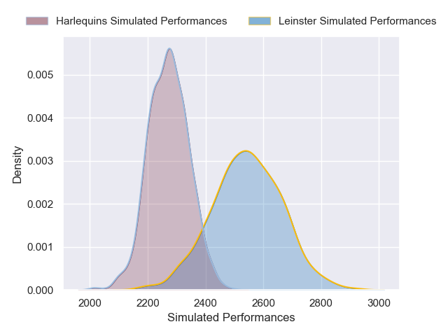
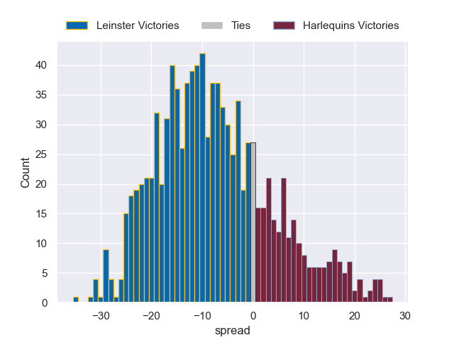

---  
layout: page  
title: Leinster V Harlequins on 2025/12/06  
date: 2025-12-06  
categories: "European Rugby Champions Cup 25/26" match projection  
---
# Leinster V Harlequins on 2025/12/06, 45.0 to 28.0

# Club Level Predictions

Now that the game has been played, lets see how the club predictions did. I predicted Leinster to win by 9.04, and Leinster won by 17.0. That's an absolute error of 8.0 for the margin of victory, while my average absolute error has been 13.8 over the past six months. This prediction was more accurate than 60.1% of my recent predictions.

For the Over/Under model, I predicted a total of 51.5 and we have an actual total of 73.0. That's an absolute error of 21.5 compared to a six month average of 13.0. This prediction was more accurate than 18.7% of my recent predictions.
## Projected Performances - Club Model

## Projected Spreads - Club Model

## Projected Results - Club Model

