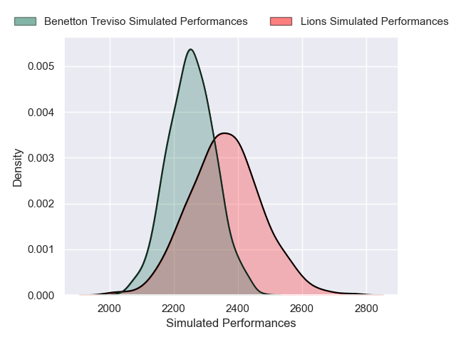
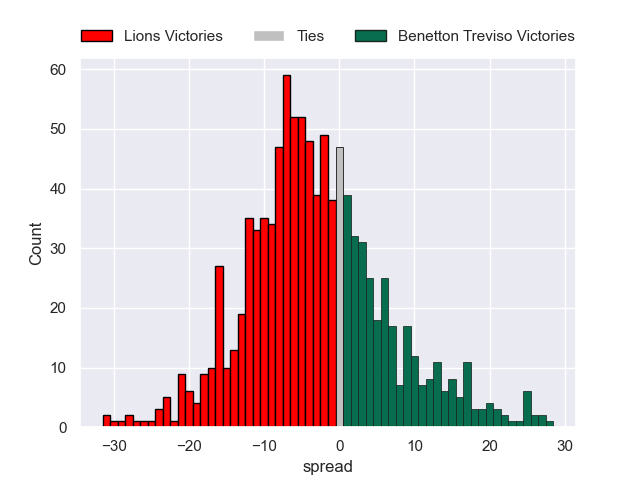

---  
layout: page  
title: Lions V Benetton Treviso on 2025/12/06  
date: 2025-12-06  
categories: "European Rugby Challenge Cup 25/26" match projection  
---
# Lions V Benetton Treviso on 2025/12/06, 18.0 to 26.0

# Club Level Predictions

Now that the game has been played, lets see how the club predictions did. I predicted Lions to win by 3.91, and Benetton Treviso won by 8.0. That's an absolute error of 11.9 for the margin of victory, while my average absolute error has been 13.9 over the past six months. This prediction was more accurate than 44.6% of my recent predictions.

For the Over/Under model, I predicted a total of 53.5 and we have an actual total of 44.0. That's an absolute error of 9.5 compared to a six month average of 13.0. This prediction was more accurate than 53.6% of my recent predictions.
## Projected Performances - Club Model

## Projected Spreads - Club Model

## Projected Results - Club Model

