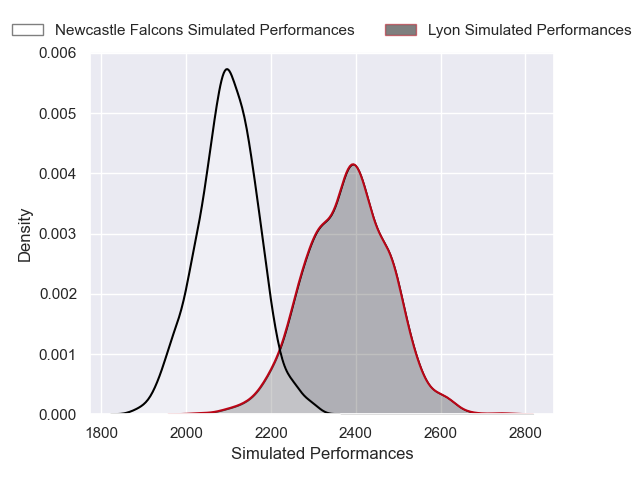
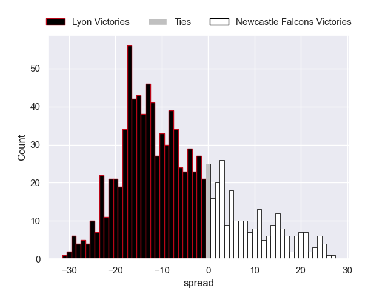

---  
layout: page  
title: Lyon V Newcastle Falcons on 2025/12/06  
date: 2025-12-06  
categories: "European Rugby Challenge Cup 25/26" match projection  
---
# Lyon V Newcastle Falcons on 2025/12/06, 14.0 to 23.0

# Club Level Predictions

Now that the game has been played, lets see how the club predictions did. I predicted Lyon to win by 7.99, and Newcastle Falcons won by 9.0. That's an absolute error of 17.0 for the margin of victory, while my average absolute error has been 13.8 over the past six months. This prediction was more accurate than 29.5% of my recent predictions.

For the Over/Under model, I predicted a total of 51.5 and we have an actual total of 37.0. That's an absolute error of 14.5 compared to a six month average of 13.0. This prediction was more accurate than 36.4% of my recent predictions.
## Projected Performances - Club Model

## Projected Spreads - Club Model

## Projected Results - Club Model

