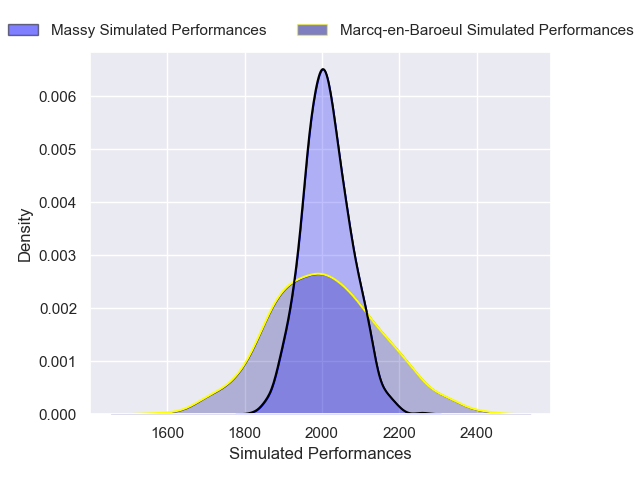
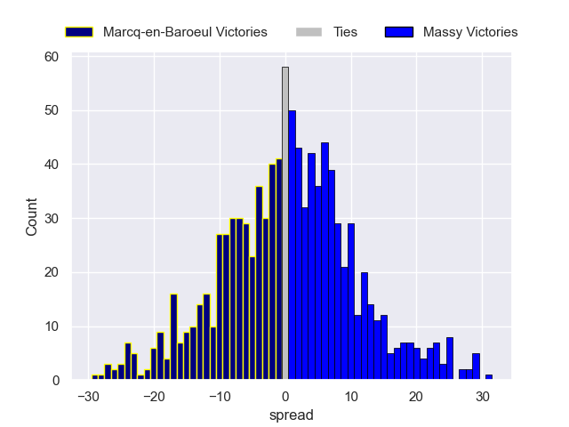

---  
layout: page  
title: Marcq-en-Baroeul V Massy on 2025/12/06  
date: 2025-12-06  
categories: "Nationale 25/26" match projection  
---
# Marcq-en-Baroeul V Massy on 2025/12/06, 19.0 to 24.0

# Club Level Predictions

Now that the game has been played, lets see how the club predictions did. I predicted Massy to win by 0.31, and Massy won by 5.0. That's an absolute error of 4.7 for the margin of victory, while my average absolute error has been 13.8 over the past six months. This prediction was more accurate than 75.6% of my recent predictions.

For the Over/Under model, I predicted a total of 45.5 and we have an actual total of 43.0. That's an absolute error of 2.5 compared to a six month average of 13.2. This prediction was more accurate than 87.3% of my recent predictions.
## Projected Performances - Club Model

## Projected Spreads - Club Model

## Projected Results - Club Model

