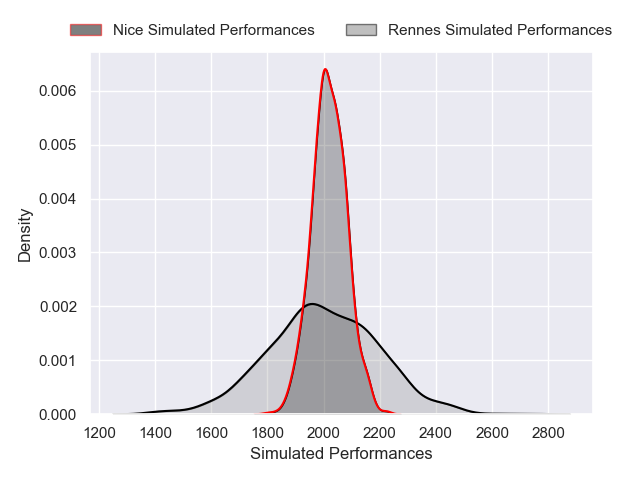
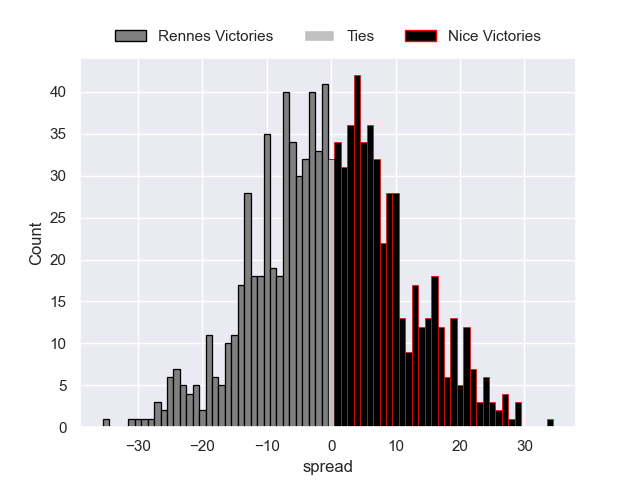

---  
layout: page  
title: Rennes V Nice on 2025/12/06  
date: 2025-12-06  
categories: "Nationale 25/26" match projection  
---
# Rennes V Nice on 2025/12/06, 21.0 to 44.0

# Club Level Predictions

Now that the game has been played, lets see how the club predictions did. I predicted Rennes to win by 0.16, and Nice won by 23.0. That's an absolute error of 23.2 for the margin of victory, while my average absolute error has been 13.9 over the past six months. This prediction was more accurate than 19.4% of my recent predictions.

For the Over/Under model, I predicted a total of 37.5 and we have an actual total of 65.0. That's an absolute error of 27.5 compared to a six month average of 13.0. This prediction was more accurate than 9.5% of my recent predictions.
## Projected Performances - Club Model

## Projected Spreads - Club Model

## Projected Results - Club Model

