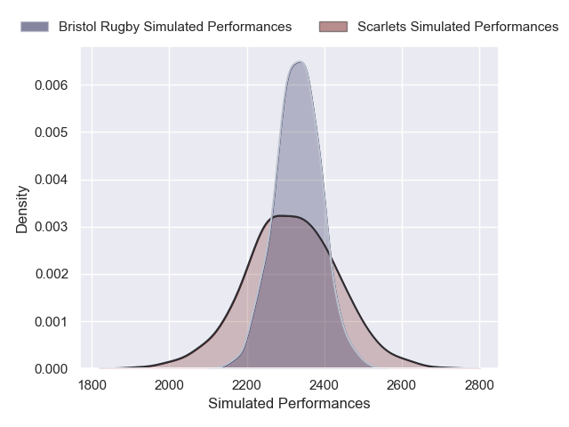
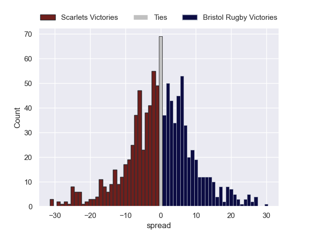

---  
layout: page  
title: Scarlets V Bristol Rugby on 2025/12/06  
date: 2025-12-06  
categories: "European Rugby Champions Cup 25/26" match projection  
---
# Scarlets V Bristol Rugby on 2025/12/06, 16.0 to 17.0

# Club Level Predictions

Now that the game has been played, lets see how the club predictions did. I predicted Scarlets to win by 0.49, and Bristol Rugby won by 1.0. That's an absolute error of 1.5 for the margin of victory, while my average absolute error has been 13.8 over the past six months. This prediction was more accurate than 91.4% of my recent predictions.

For the Over/Under model, I predicted a total of 52.5 and we have an actual total of 33.0. That's an absolute error of 19.5 compared to a six month average of 13.2. This prediction was more accurate than 23.0% of my recent predictions.
## Projected Performances - Club Model

## Projected Spreads - Club Model

## Projected Results - Club Model

