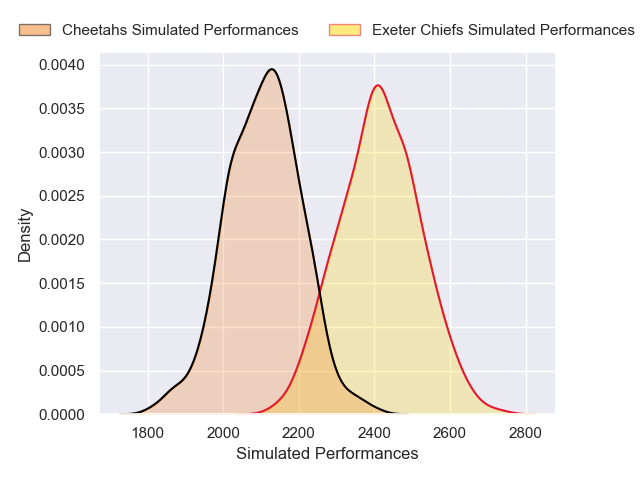
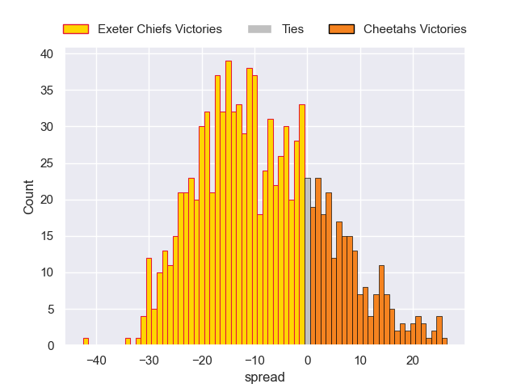

---  
layout: page  
title: Exeter Chiefs V Cheetahs on 2025/12/07  
date: 2025-12-07  
categories: "European Rugby Challenge Cup 25/26" match projection  
---
# Exeter Chiefs V Cheetahs on 2025/12/07, 42.0 to 12.0

# Club Level Predictions

Now that the game has been played, lets see how the club predictions did. I predicted Exeter Chiefs to win by 8.79, and Exeter Chiefs won by 30.0. That's an absolute error of 21.2 for the margin of victory, while my average absolute error has been 13.8 over the past six months. This prediction was more accurate than 22.0% of my recent predictions.

For the Over/Under model, I predicted a total of 52.5 and we have an actual total of 54.0. That's an absolute error of 1.5 compared to a six month average of 13.0. This prediction was more accurate than 92.5% of my recent predictions.
## Projected Performances - Club Model

## Projected Spreads - Club Model

## Projected Results - Club Model

