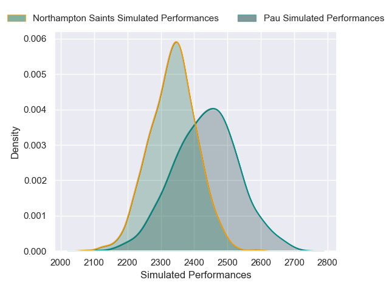
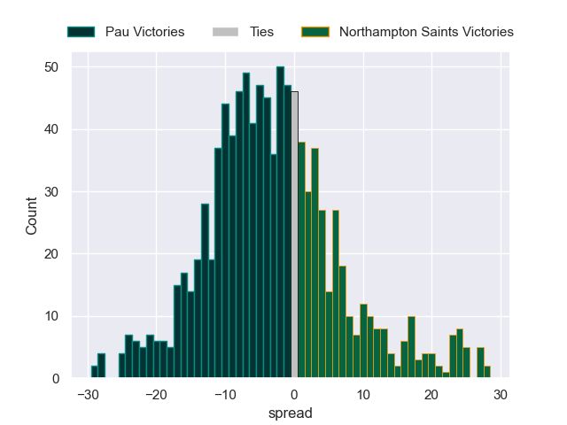

---  
layout: page  
title: Pau V Northampton Saints on 2025/12/07  
date: 2025-12-07  
categories: "European Rugby Champions Cup 25/26" match projection  
---
# Pau V Northampton Saints on 2025/12/07, 27.0 to 35.0

# Club Level Predictions

Now that the game has been played, lets see how the club predictions did. I predicted Pau to win by 5.12, and Northampton Saints won by 8.0. That's an absolute error of 13.1 for the margin of victory, while my average absolute error has been 13.8 over the past six months. This prediction was more accurate than 39.9% of my recent predictions.

For the Over/Under model, I predicted a total of 57.5 and we have an actual total of 62.0. That's an absolute error of 4.5 compared to a six month average of 13.2. This prediction was more accurate than 77.8% of my recent predictions.
## Projected Performances - Club Model

## Projected Spreads - Club Model

## Projected Results - Club Model

