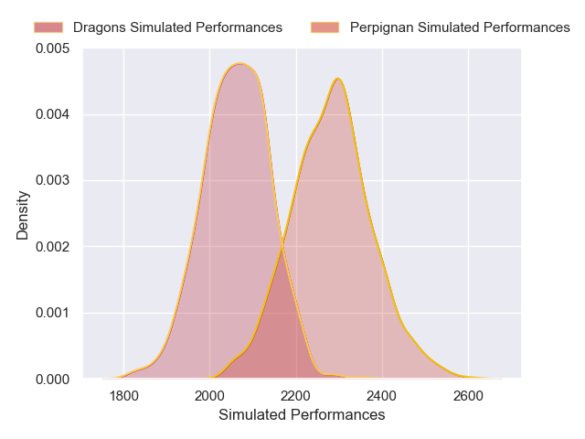
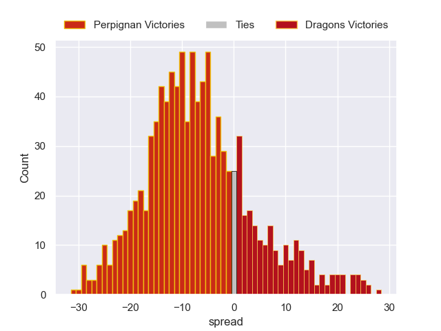

---  
layout: page  
title: Perpignan V Dragons on 2025/12/07  
date: 2025-12-07  
categories: "European Rugby Challenge Cup 25/26" match projection  
---
# Perpignan V Dragons on 2025/12/07, 41.0 to 17.0

# Club Level Predictions

Now that the game has been played, lets see how the club predictions did. I predicted Perpignan to win by 5.08, and Perpignan won by 24.0. That's an absolute error of 18.9 for the margin of victory, while my average absolute error has been 13.8 over the past six months. This prediction was more accurate than 26.0% of my recent predictions.

For the Over/Under model, I predicted a total of 44.5 and we have an actual total of 58.0. That's an absolute error of 13.5 compared to a six month average of 13.2. This prediction was more accurate than 39.6% of my recent predictions.
## Projected Performances - Club Model

## Projected Spreads - Club Model

## Projected Results - Club Model

