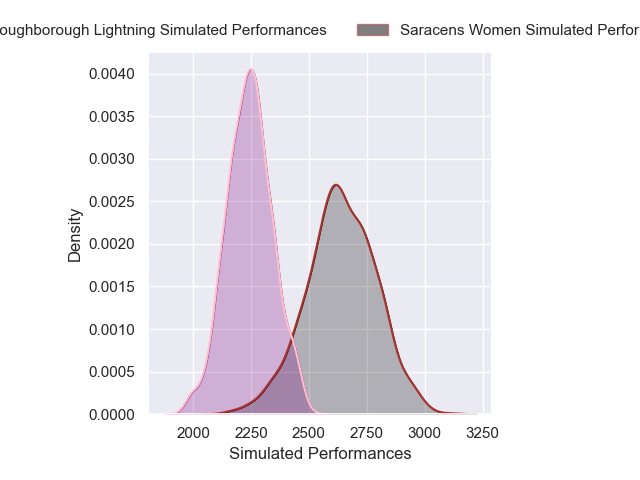
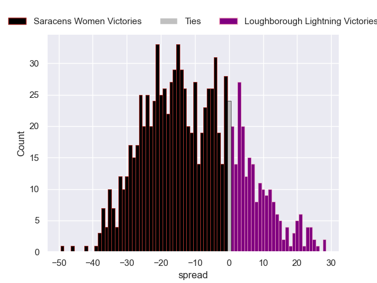

---  
layout: page  
title: Saracens Women V Loughborough Lightning on 2025/12/07  
date: 2025-12-07  
categories: "PWR 25/26" match projection  
---
# Saracens Women V Loughborough Lightning on 2025/12/07, 33.0 to 15.0

# Club Level Predictions

Now that the game has been played, lets see how the club predictions did. I predicted Saracens Women to win by 10.63, and Saracens Women won by 18.0. That's an absolute error of 7.4 for the margin of victory, while my average absolute error has been 13.8 over the past six months. This prediction was more accurate than 63.5% of my recent predictions.

For the Over/Under model, I predicted a total of 59.5 and we have an actual total of 48.0. That's an absolute error of 11.5 compared to a six month average of 13.2. This prediction was more accurate than 47.3% of my recent predictions.
## Projected Performances - Club Model

## Projected Spreads - Club Model

## Projected Results - Club Model

