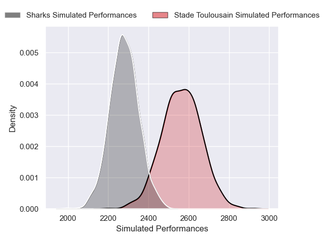
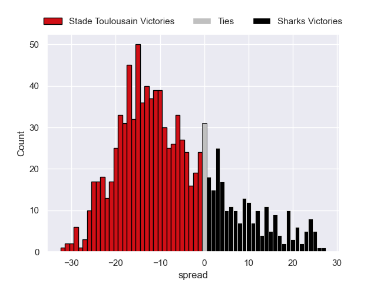

---  
layout: page  
title: Stade Toulousain V Sharks on 2025/12/07  
date: 2025-12-07  
categories: "European Rugby Champions Cup 25/26" match projection  
---
# Stade Toulousain V Sharks on 2025/12/07, 56.0 to 19.0

# Club Level Predictions

Now that the game has been played, lets see how the club predictions did. I predicted Stade Toulousain to win by 9.22, and Stade Toulousain won by 37.0. That's an absolute error of 27.8 for the margin of victory, while my average absolute error has been 13.9 over the past six months. This prediction was more accurate than 12.4% of my recent predictions.

For the Over/Under model, I predicted a total of 53.5 and we have an actual total of 75.0. That's an absolute error of 21.5 compared to a six month average of 13.0. This prediction was more accurate than 18.7% of my recent predictions.
## Projected Performances - Club Model

## Projected Spreads - Club Model

## Projected Results - Club Model

