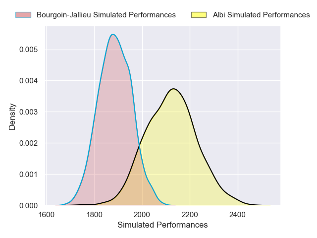
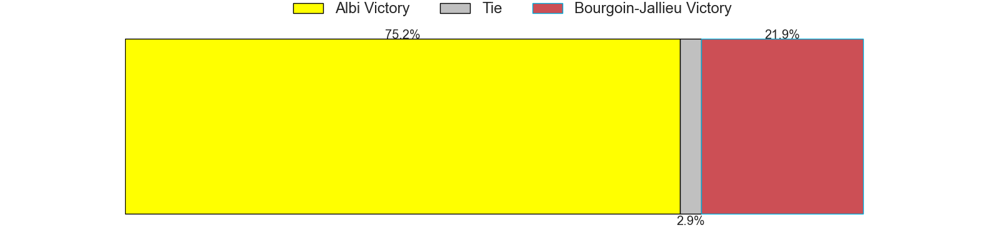

---  
layout: page  
title: Albi V Bourgoin-Jallieu on 2025/12/12  
date: 2025-12-12  
categories: "Nationale 25/26" match projection  
---
# Albi V Bourgoin-Jallieu on 2025/12/12, 26.0 to 10.0

# Club Level Predictions

Now that the game has been played, lets see how the club predictions did. I predicted Albi to win by 6.68, and Albi won by 16.0. That's an absolute error of 9.3 for the margin of victory, while my average absolute error has been 13.9 over the past six months. This prediction was more accurate than 52.7% of my recent predictions.

For the Over/Under model, I predicted a total of 40.5 and we have an actual total of 36.0. That's an absolute error of 4.5 compared to a six month average of 12.9. This prediction was more accurate than 77.5% of my recent predictions.
## Projected Performances - Club Model

## Projected Spreads - Club Model

## Projected Results - Club Model

