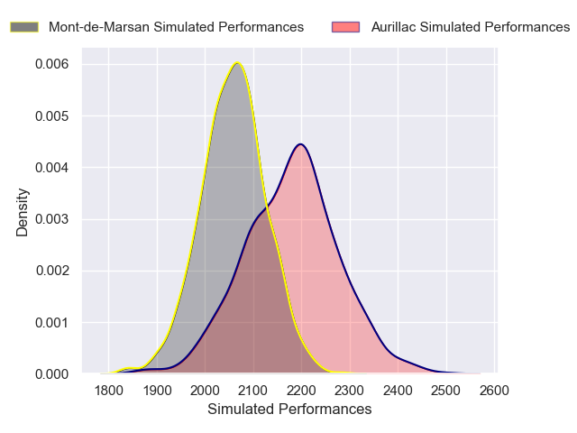
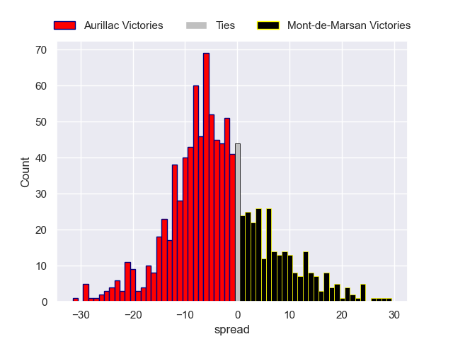
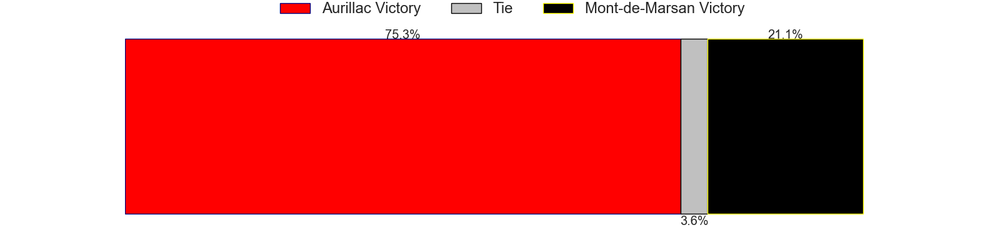

---  
layout: page  
title: Aurillac V Mont-de-Marsan on 2025/12/12  
date: 2025-12-12  
categories: "Pro D2 25/26" match projection  
---
# Aurillac V Mont-de-Marsan on 2025/12/12, 32.0 to 19.0

# Club Level Predictions

Now that the game has been played, lets see how the club predictions did. I predicted Aurillac to win by 5.31, and Aurillac won by 13.0. That's an absolute error of 7.7 for the margin of victory, while my average absolute error has been 13.9 over the past six months. This prediction was more accurate than 61.4% of my recent predictions.

For the Over/Under model, I predicted a total of 48.5 and we have an actual total of 51.0. That's an absolute error of 2.5 compared to a six month average of 12.9. This prediction was more accurate than 87.4% of my recent predictions.
## Projected Performances - Club Model

## Projected Spreads - Club Model

## Projected Results - Club Model

