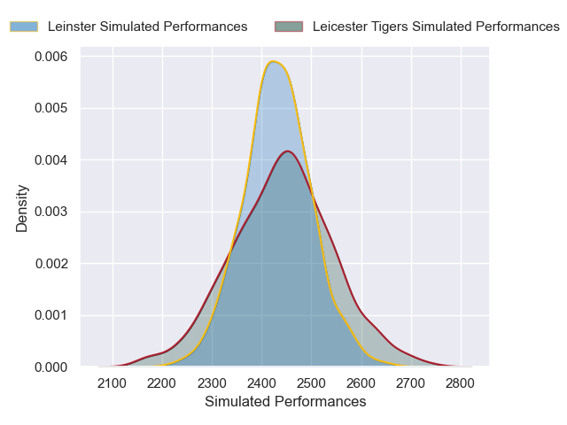
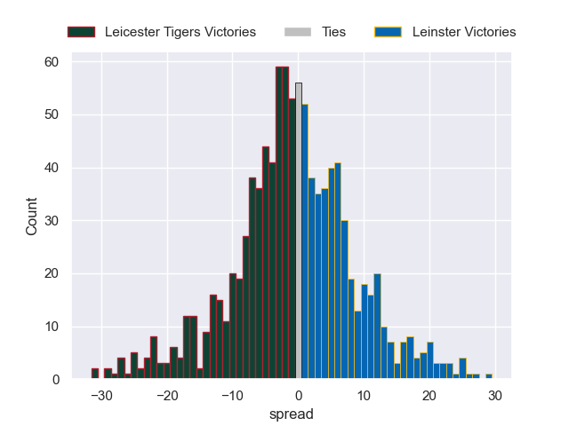

---  
layout: page  
title: Leicester Tigers V Leinster on 2025/12/12  
date: 2025-12-12  
categories: "European Rugby Champions Cup 25/26" match projection  
---
# Leicester Tigers V Leinster on 2025/12/12, 15.0 to 23.0

# Club Level Predictions

Now that the game has been played, lets see how the club predictions did. I predicted Leicester Tigers to win by 0.62, and Leinster won by 8.0. That's an absolute error of 8.6 for the margin of victory, while my average absolute error has been 13.9 over the past six months. This prediction was more accurate than 55.7% of my recent predictions.

For the Over/Under model, I predicted a total of 53.5 and we have an actual total of 38.0. That's an absolute error of 15.5 compared to a six month average of 12.9. This prediction was more accurate than 32.3% of my recent predictions.
## Projected Performances - Club Model

## Projected Spreads - Club Model

## Projected Results - Club Model

