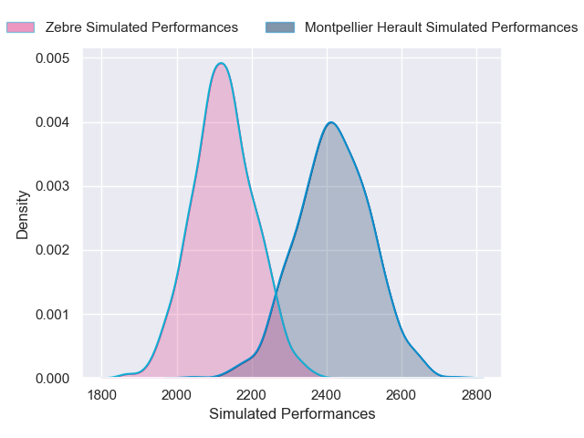
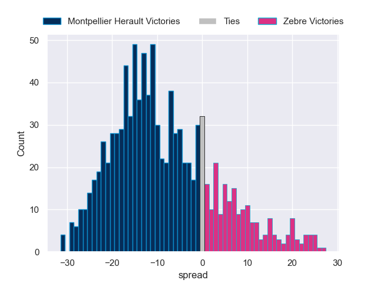

---  
layout: page  
title: Montpellier Herault V Zebre on 2025/12/12  
date: 2025-12-12  
categories: "European Rugby Challenge Cup 25/26" match projection  
---
# Montpellier Herault V Zebre on 2025/12/12, 31.0 to 7.0

# Club Level Predictions

Now that the game has been played, lets see how the club predictions did. I predicted Montpellier Herault to win by 8.8, and Montpellier Herault won by 24.0. That's an absolute error of 15.2 for the margin of victory, while my average absolute error has been 13.9 over the past six months. This prediction was more accurate than 35.0% of my recent predictions.

For the Over/Under model, I predicted a total of 49.5 and we have an actual total of 38.0. That's an absolute error of 11.5 compared to a six month average of 12.9. This prediction was more accurate than 45.9% of my recent predictions.
## Projected Performances - Club Model

## Projected Spreads - Club Model

## Projected Results - Club Model

