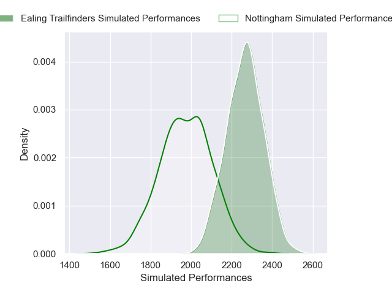
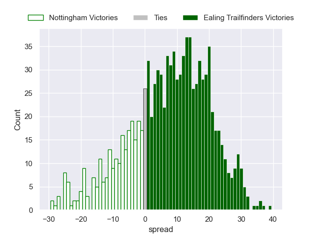

---  
layout: page  
title: Nottingham V Ealing Trailfinders on 2025/12/12  
date: 2025-12-12  
categories: "RFU Championship 25/26" match projection  
---
# Nottingham V Ealing Trailfinders on 2025/12/12, 14.0 to 17.0

# Club Level Predictions

Now that the game has been played, lets see how the club predictions did. I predicted Ealing Trailfinders to win by 9.19, and Ealing Trailfinders won by 3.0. That's an absolute error of 6.2 for the margin of victory, while my average absolute error has been 13.9 over the past six months. This prediction was more accurate than 67.8% of my recent predictions.

For the Over/Under model, I predicted a total of 57.5 and we have an actual total of 31.0. That's an absolute error of 26.5 compared to a six month average of 12.9. This prediction was more accurate than 10.7% of my recent predictions.
## Projected Performances - Club Model

## Projected Spreads - Club Model

## Projected Results - Club Model

