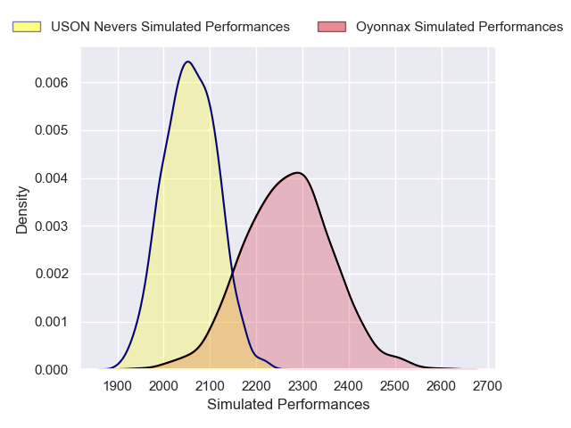
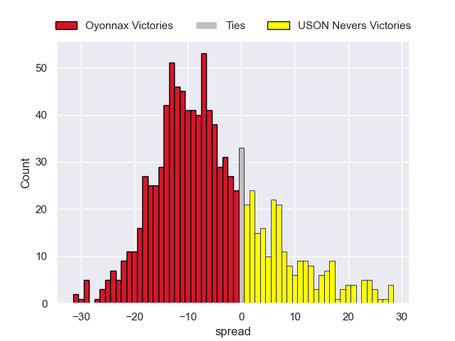

---  
layout: page  
title: Oyonnax V USON Nevers on 2025/12/12  
date: 2025-12-12  
categories: "Pro D2 25/26" match projection  
---
# Oyonnax V USON Nevers on 2025/12/12, 34.0 to 18.0

# Club Level Predictions

Now that the game has been played, lets see how the club predictions did. I predicted Oyonnax to win by 5.33, and Oyonnax won by 16.0. That's an absolute error of 10.7 for the margin of victory, while my average absolute error has been 13.9 over the past six months. This prediction was more accurate than 48.1% of my recent predictions.

For the Over/Under model, I predicted a total of 47.5 and we have an actual total of 52.0. That's an absolute error of 4.5 compared to a six month average of 12.9. This prediction was more accurate than 77.5% of my recent predictions.
## Projected Performances - Club Model

## Projected Spreads - Club Model

## Projected Results - Club Model

