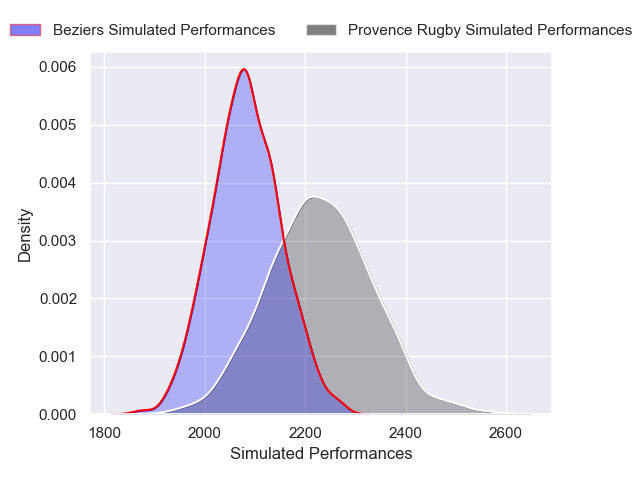
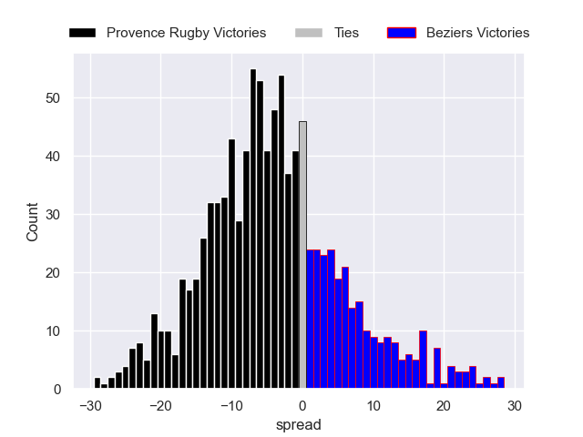

---  
layout: page  
title: Provence Rugby V Beziers on 2025/12/12  
date: 2025-12-12  
categories: "Pro D2 25/26" match projection  
---
# Provence Rugby V Beziers on 2025/12/12, 38.0 to 18.0

# Club Level Predictions

Now that the game has been played, lets see how the club predictions did. I predicted Provence Rugby to win by 7.05, and Provence Rugby won by 20.0. That's an absolute error of 13.0 for the margin of victory, while my average absolute error has been 13.9 over the past six months. This prediction was more accurate than 40.6% of my recent predictions.

For the Over/Under model, I predicted a total of 46.5 and we have an actual total of 56.0. That's an absolute error of 9.5 compared to a six month average of 12.9. This prediction was more accurate than 53.7% of my recent predictions.
## Projected Performances - Club Model

## Projected Spreads - Club Model

## Projected Results - Club Model

