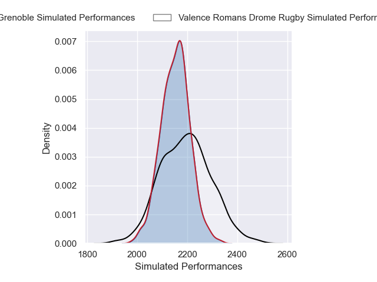
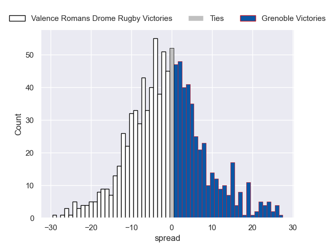

---  
layout: page  
title: Valence Romans Drome Rugby V Grenoble on 2025/12/12  
date: 2025-12-12  
categories: "Pro D2 25/26" match projection  
---
# Valence Romans Drome Rugby V Grenoble on 2025/12/12, 33.0 to 15.0

# Club Level Predictions

Now that the game has been played, lets see how the club predictions did. I predicted Valence Romans Drome Rugby to win by 3.25, and Valence Romans Drome Rugby won by 18.0. That's an absolute error of 14.8 for the margin of victory, while my average absolute error has been 13.9 over the past six months. This prediction was more accurate than 35.8% of my recent predictions.

For the Over/Under model, I predicted a total of 48.5 and we have an actual total of 48.0. That's an absolute error of 0.5 compared to a six month average of 12.9. This prediction was more accurate than 97.5% of my recent predictions.
## Projected Performances - Club Model

## Projected Spreads - Club Model

## Projected Results - Club Model

