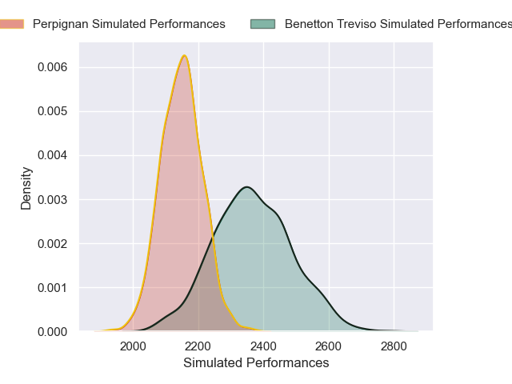
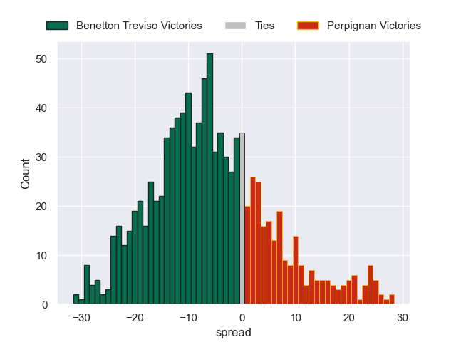

---  
layout: page  
title: Benetton Treviso V Perpignan on 2025/12/13  
date: 2025-12-13  
categories: "European Rugby Challenge Cup 25/26" match projection  
---
# Benetton Treviso V Perpignan on 2025/12/13, 44.0 to 31.0

# Club Level Predictions

Now that the game has been played, lets see how the club predictions did. I predicted Benetton Treviso to win by 5.72, and Benetton Treviso won by 13.0. That's an absolute error of 7.3 for the margin of victory, while my average absolute error has been 13.9 over the past six months. This prediction was more accurate than 63.4% of my recent predictions.

For the Over/Under model, I predicted a total of 49.5 and we have an actual total of 75.0. That's an absolute error of 25.5 compared to a six month average of 12.9. This prediction was more accurate than 12.2% of my recent predictions.
## Projected Performances - Club Model

## Projected Spreads - Club Model

## Projected Results - Club Model

