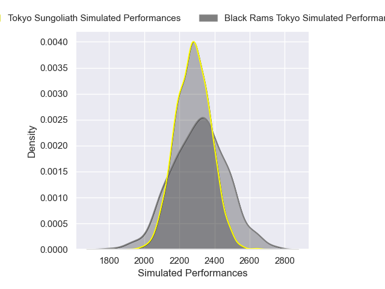
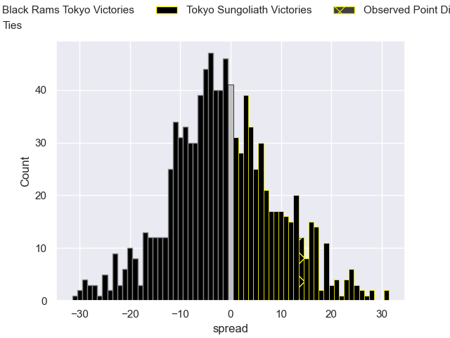

---  
layout: page  
title: Black Rams Tokyo V Tokyo Sungoliath on 2025/12/13  
date: 2025-12-13  
categories: "Japan Rugby League One 25/26" match projection  
---
# Black Rams Tokyo V Tokyo Sungoliath on 2025/12/13, 15.0 to 29.0

# Club Level Predictions

Now that the game has been played, lets see how the club predictions did. I predicted Black Rams Tokyo to win by 1.14, and Tokyo Sungoliath won by 14.0. That's an absolute error of 15.1 for the margin of victory, while my average absolute error has been 13.9 over the past six months. This prediction was more accurate than 35.1% of my recent predictions.

For the Over/Under model, I predicted a total of 58.5 and we have an actual total of 44.0. That's an absolute error of 14.5 compared to a six month average of 12.9. This prediction was more accurate than 35.5% of my recent predictions.
## Projected Performances - Club Model

## Projected Spreads - Club Model

## Projected Results - Club Model

