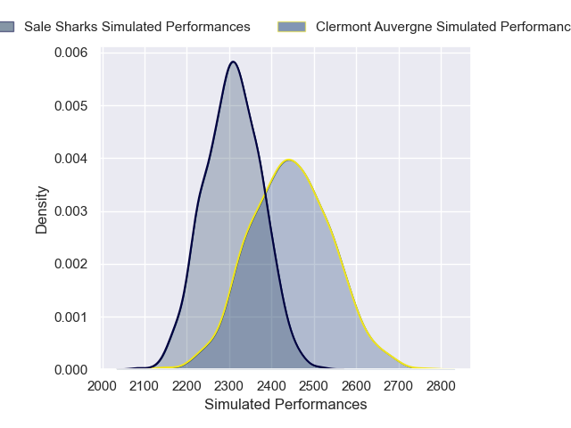
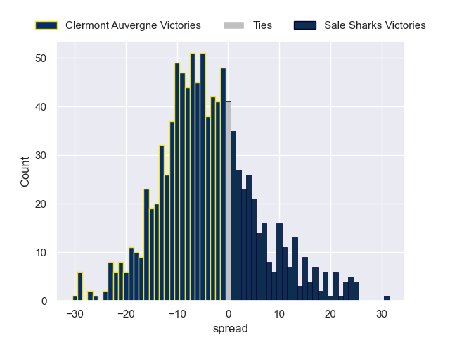

---  
layout: page  
title: Clermont Auvergne V Sale Sharks on 2025/12/13  
date: 2025-12-13  
categories: "European Rugby Champions Cup 25/26" match projection  
---
# Clermont Auvergne V Sale Sharks on 2025/12/13, 14.0 to 35.0

# Club Level Predictions

Now that the game has been played, lets see how the club predictions did. I predicted Clermont Auvergne to win by 3.26, and Sale Sharks won by 21.0. That's an absolute error of 24.3 for the margin of victory, while my average absolute error has been 13.9 over the past six months. This prediction was more accurate than 17.5% of my recent predictions.

For the Over/Under model, I predicted a total of 52.5 and we have an actual total of 49.0. That's an absolute error of 3.5 compared to a six month average of 12.9. This prediction was more accurate than 82.7% of my recent predictions.
## Projected Performances - Club Model

## Projected Spreads - Club Model

## Projected Results - Club Model

