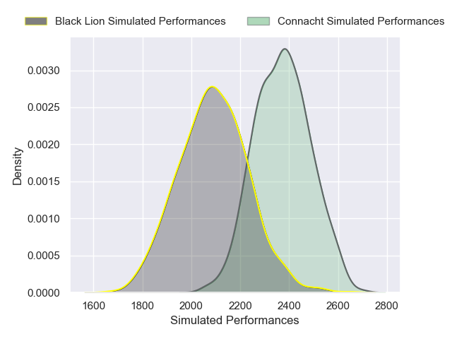
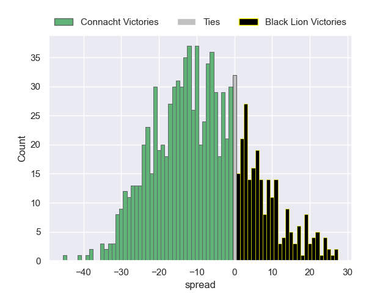
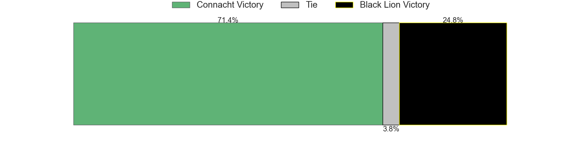

---  
layout: page  
title: Connacht V Black Lion on 2025/12/13  
date: 2025-12-13  
categories: "European Rugby Challenge Cup 25/26" match projection  
---
# Connacht V Black Lion on 2025/12/13, 52.0 to 0.0

# Club Level Predictions

Now that the game has been played, lets see how the club predictions did. I predicted Connacht to win by 8.6, and Connacht won by 52.0. That's an absolute error of 43.4 for the margin of victory, while my average absolute error has been 13.9 over the past six months. This prediction was more accurate than 3.7% of my recent predictions.

For the Over/Under model, I predicted a total of 48.5 and we have an actual total of 52.0. That's an absolute error of 3.5 compared to a six month average of 12.9. This prediction was more accurate than 82.7% of my recent predictions.
## Projected Performances - Club Model

## Projected Spreads - Club Model

## Projected Results - Club Model

