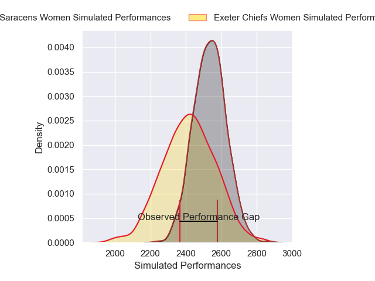
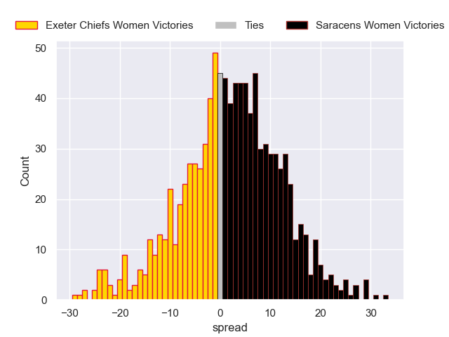

---  
layout: page  
title: Exeter Chiefs Women V Saracens Women on 2025/12/13  
date: 2025-12-13  
categories: "PWR 25/26" match projection  
---
# Exeter Chiefs Women V Saracens Women on 2025/12/13, 14.0 to 24.0

# Club Level Predictions

Now that the game has been played, lets see how the club predictions did. I predicted Saracens Women to win by 3.82, and Saracens Women won by 10.0. That's an absolute error of 6.2 for the margin of victory, while my average absolute error has been 13.9 over the past six months. This prediction was more accurate than 67.8% of my recent predictions.

For the Over/Under model, I predicted a total of 53.5 and we have an actual total of 38.0. That's an absolute error of 15.5 compared to a six month average of 12.9. This prediction was more accurate than 32.3% of my recent predictions.
## Projected Performances - Club Model

## Projected Spreads - Club Model

## Projected Results - Club Model

