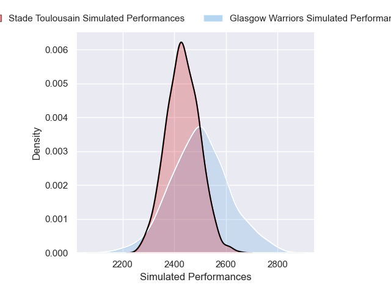
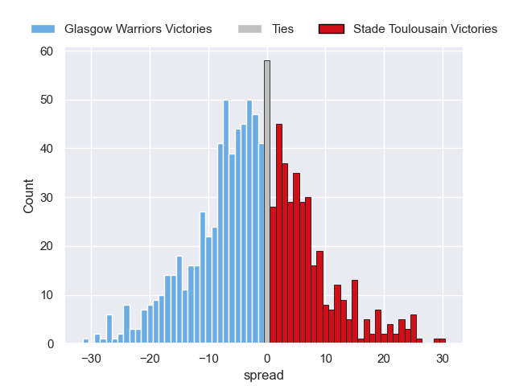
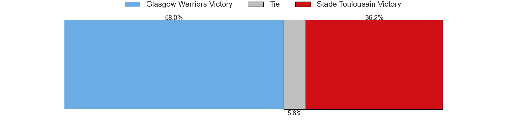

---  
layout: page  
title: Glasgow Warriors V Stade Toulousain on 2025/12/13  
date: 2025-12-13  
categories: "European Rugby Champions Cup 25/26" match projection  
---
# Glasgow Warriors V Stade Toulousain on 2025/12/13, 28.0 to 21.0

# Club Level Predictions

Now that the game has been played, lets see how the club predictions did. I predicted Glasgow Warriors to win by 0.69, and Glasgow Warriors won by 7.0. That's an absolute error of 6.3 for the margin of victory, while my average absolute error has been 13.9 over the past six months. This prediction was more accurate than 67.6% of my recent predictions.

For the Over/Under model, I predicted a total of 51.5 and we have an actual total of 49.0. That's an absolute error of 2.5 compared to a six month average of 12.9. This prediction was more accurate than 86.8% of my recent predictions.
## Projected Performances - Club Model

## Projected Spreads - Club Model

## Projected Results - Club Model

