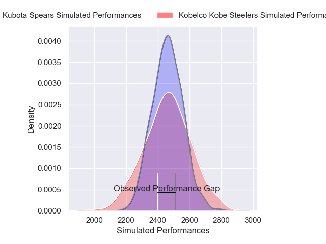
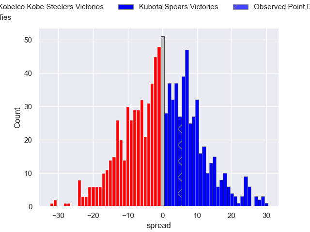

---  
layout: page  
title: Kobelco Kobe Steelers V Kubota Spears on 2025/12/13  
date: 2025-12-13  
categories: "Japan Rugby League One 25/26" match projection  
---
# Kobelco Kobe Steelers V Kubota Spears on 2025/12/13, 28.0 to 33.0

# Club Level Predictions

Now that the game has been played, lets see how the club predictions did. I predicted Kubota Spears to win by 0.25, and Kubota Spears won by 5.0. That's an absolute error of 4.8 for the margin of victory, while my average absolute error has been 13.9 over the past six months. This prediction was more accurate than 75.0% of my recent predictions.

For the Over/Under model, I predicted a total of 50.5 and we have an actual total of 61.0. That's an absolute error of 10.5 compared to a six month average of 12.9. This prediction was more accurate than 50.1% of my recent predictions.
## Projected Performances - Club Model

## Projected Spreads - Club Model

## Projected Results - Club Model

