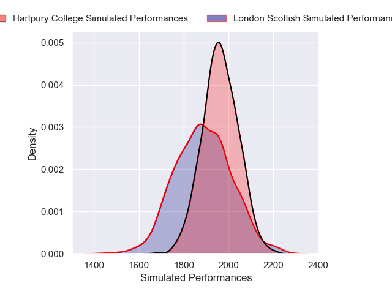

---  
layout: page  
title: London Scottish V Hartpury College on 2025/12/13  
date: 2025-12-13  
categories: "RFU Championship 25/26" match projection  
---
# London Scottish V Hartpury College on 2025/12/13, 24.0 to 33.0

# Club Level Predictions

Now that the game has been played, lets see how the club predictions did. I predicted Hartpury College to win by 3.14, and Hartpury College won by 9.0. That's an absolute error of 5.9 for the margin of victory, while my average absolute error has been 13.9 over the past six months. This prediction was more accurate than 69.4% of my recent predictions.

For the Over/Under model, I predicted a total of 58.5 and we have an actual total of 57.0. That's an absolute error of 1.5 compared to a six month average of 12.9. This prediction was more accurate than 92.9% of my recent predictions.
## Projected Performances - Club Model

## Projected Spreads - Club Model

## Projected Results - Club Model

