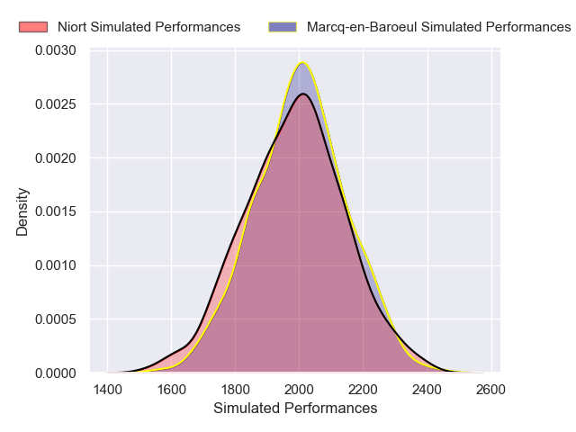
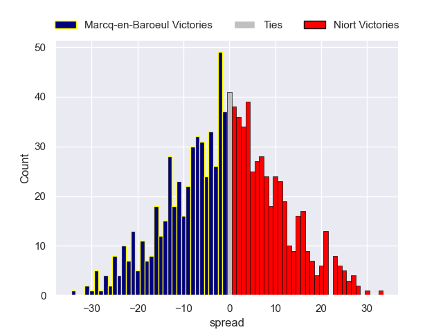

---  
layout: page  
title: Marcq-en-Baroeul V Niort on 2025/12/13  
date: 2025-12-13  
categories: "Nationale 25/26" match projection  
---
# Marcq-en-Baroeul V Niort on 2025/12/13, 29.0 to 29.0

# Club Level Predictions

Now that the game has been played, lets see how the club predictions did. I predicted Niort to win by 0.67, and Niort won by 0.0. That's an absolute error of 0.7 for the margin of victory, while my average absolute error has been 13.9 over the past six months. This prediction was more accurate than 96.4% of my recent predictions.

For the Over/Under model, I predicted a total of 46.5 and we have an actual total of 58.0. That's an absolute error of 11.5 compared to a six month average of 12.9. This prediction was more accurate than 46.0% of my recent predictions.
## Projected Performances - Club Model

## Projected Spreads - Club Model

## Projected Results - Club Model

