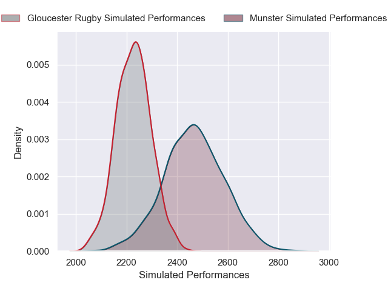
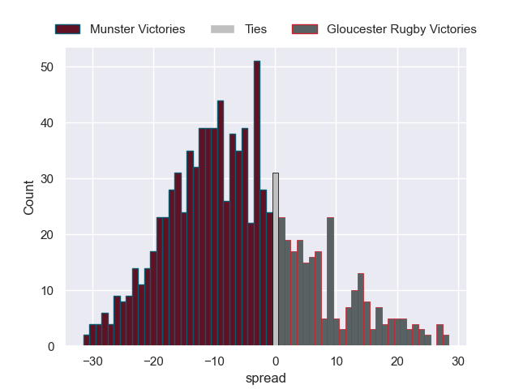

---  
layout: page  
title: Munster V Gloucester Rugby on 2025/12/13  
date: 2025-12-13  
categories: "European Rugby Champions Cup 25/26" match projection  
---
# Munster V Gloucester Rugby on 2025/12/13, 31.0 to 3.0

# Club Level Predictions

Now that the game has been played, lets see how the club predictions did. I predicted Munster to win by 5.89, and Munster won by 28.0. That's an absolute error of 22.1 for the margin of victory, while my average absolute error has been 13.9 over the past six months. This prediction was more accurate than 20.8% of my recent predictions.

For the Over/Under model, I predicted a total of 47.5 and we have an actual total of 34.0. That's an absolute error of 13.5 compared to a six month average of 12.9. This prediction was more accurate than 39.0% of my recent predictions.
## Projected Performances - Club Model

## Projected Spreads - Club Model

## Projected Results - Club Model

