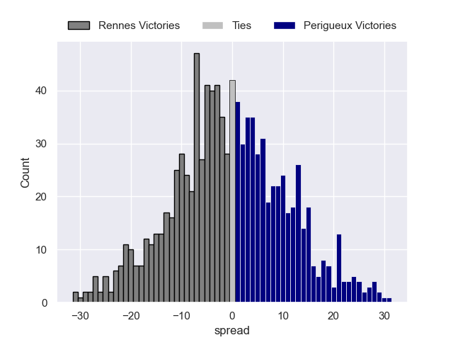

---  
layout: page  
title: Rennes V Périgueux on 2025/12/13  
date: 2025-12-13  
categories: "Nationale 25/26" match projection  
---
# Rennes V Périgueux on 2025/12/13, 8.0 to 9.0

# Club Level Predictions

Now that the game has been played, lets see how the club predictions did. I predicted Rennes to win by 0.34, and Perigueux won by 1.0. That's an absolute error of 1.3 for the margin of victory, while my average absolute error has been 13.9 over the past six months. This prediction was more accurate than 92.7% of my recent predictions.

For the Over/Under model, I predicted a total of 39.5 and we have an actual total of 17.0. That's an absolute error of 22.5 compared to a six month average of 12.9. This prediction was more accurate than 17.0% of my recent predictions.
## Projected Performances - Club Model

## Projected Spreads - Club Model

## Projected Results - Club Model

