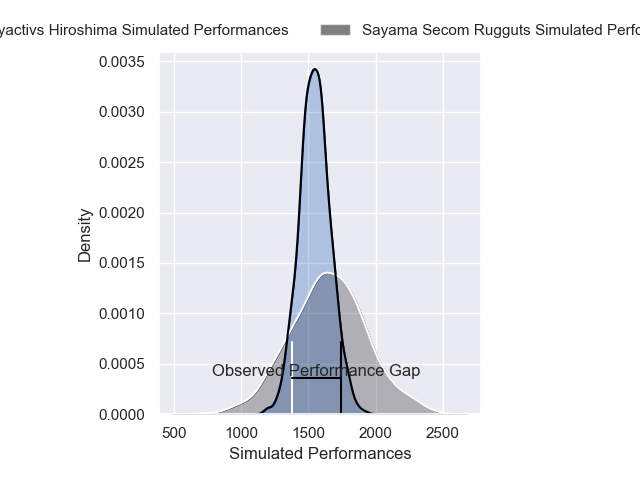
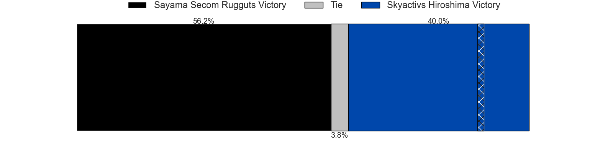

---  
layout: page  
title: Sayama Secom Rugguts V Skyactivs Hiroshima on 2025/12/13  
date: 2025-12-13  
categories: "Japan Rugby League One D3 25/26" match projection  
---
# Sayama Secom Rugguts V Skyactivs Hiroshima on 2025/12/13, 26.0 to 40.0

# Club Level Predictions

Now that the game has been played, lets see how the club predictions did. I predicted Sayama Secom Rugguts to win by 3.18, and Skyactivs Hiroshima won by 14.0. That's an absolute error of 17.2 for the margin of victory, while my average absolute error has been 13.9 over the past six months. This prediction was more accurate than 29.4% of my recent predictions.

For the Over/Under model, I predicted a total of 55.5 and we have an actual total of 66.0. That's an absolute error of 10.5 compared to a six month average of 12.9. This prediction was more accurate than 50.1% of my recent predictions.
## Projected Performances - Club Model

## Projected Spreads - Club Model

## Projected Results - Club Model

