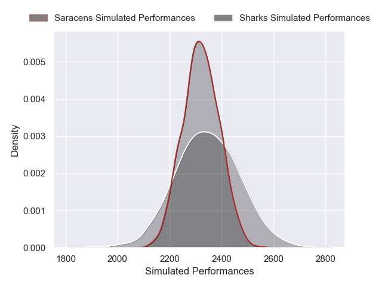
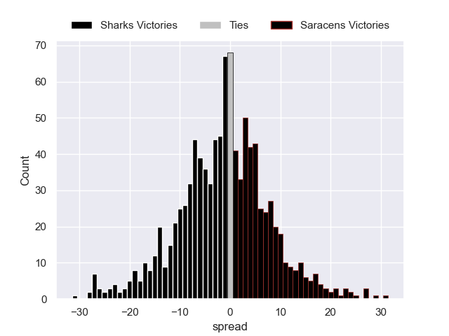

---  
layout: page  
title: Sharks V Saracens on 2025/12/13  
date: 2025-12-13  
categories: "European Rugby Champions Cup 25/26" match projection  
---
# Sharks V Saracens on 2025/12/13, 28.0 to 23.0

# Club Level Predictions

Now that the game has been played, lets see how the club predictions did. I predicted Saracens to win by 0.46, and Sharks won by 5.0. That's an absolute error of 5.5 for the margin of victory, while my average absolute error has been 13.9 over the past six months. This prediction was more accurate than 71.6% of my recent predictions.

For the Over/Under model, I predicted a total of 58.5 and we have an actual total of 51.0. That's an absolute error of 7.5 compared to a six month average of 12.9. This prediction was more accurate than 62.9% of my recent predictions.
## Projected Performances - Club Model

## Projected Spreads - Club Model

## Projected Results - Club Model

