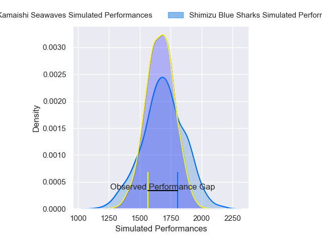
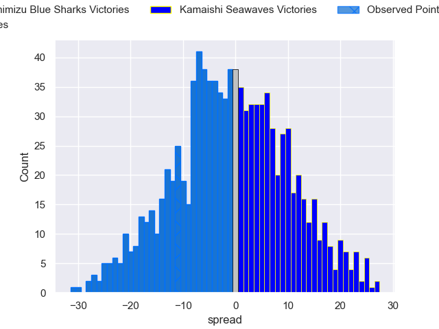
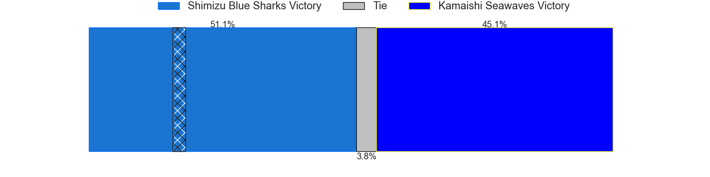

---  
layout: page  
title: Shimizu Blue Sharks V Kamaishi Seawaves on 2025/12/13  
date: 2025-12-13  
categories: "Japan Rugby League One D2 25/26" match projection  
---
# Shimizu Blue Sharks V Kamaishi Seawaves on 2025/12/13, 28.0 to 17.0

# Club Level Predictions

Now that the game has been played, lets see how the club predictions did. I predicted Shimizu Blue Sharks to win by 0.23, and Shimizu Blue Sharks won by 11.0. That's an absolute error of 10.8 for the margin of victory, while my average absolute error has been 13.9 over the past six months. This prediction was more accurate than 47.7% of my recent predictions.

For the Over/Under model, I predicted a total of 54.5 and we have an actual total of 45.0. That's an absolute error of 9.5 compared to a six month average of 12.9. This prediction was more accurate than 53.9% of my recent predictions.
## Projected Performances - Club Model

## Projected Spreads - Club Model

## Projected Results - Club Model

