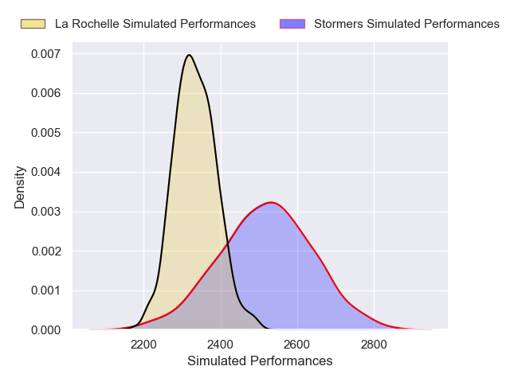
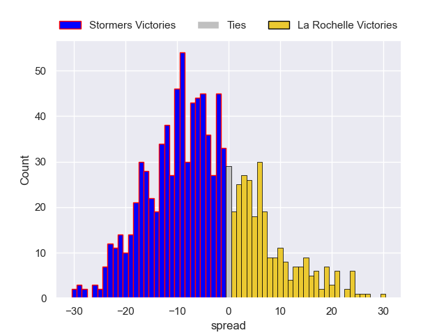
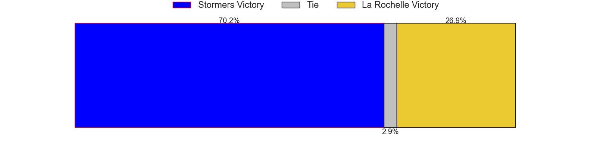

---  
layout: page  
title: Stormers V La Rochelle on 2025/12/13  
date: 2025-12-13  
categories: "European Rugby Champions Cup 25/26" match projection  
---
# Stormers V La Rochelle on 2025/12/13, 42.0 to 21.0

# Club Level Predictions

Now that the game has been played, lets see how the club predictions did. I predicted Stormers to win by 5.18, and Stormers won by 21.0. That's an absolute error of 15.8 for the margin of victory, while my average absolute error has been 13.9 over the past six months. This prediction was more accurate than 32.2% of my recent predictions.

For the Over/Under model, I predicted a total of 52.5 and we have an actual total of 63.0. That's an absolute error of 10.5 compared to a six month average of 12.9. This prediction was more accurate than 50.1% of my recent predictions.
## Projected Performances - Club Model

## Projected Spreads - Club Model

## Projected Results - Club Model

