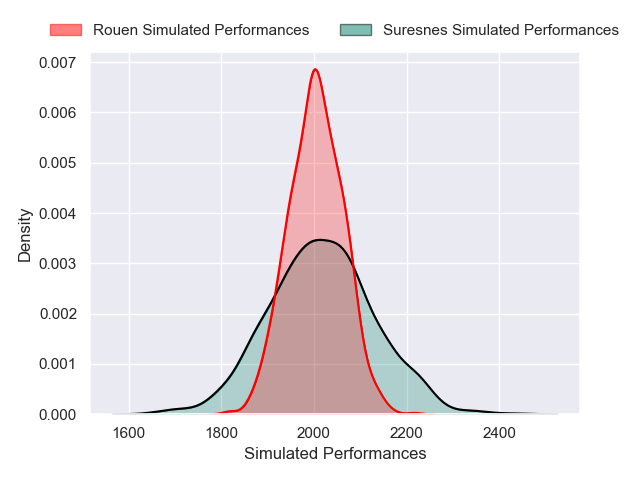
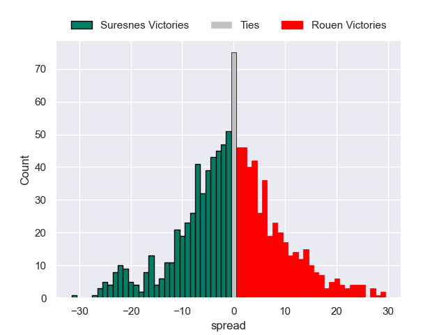

---  
layout: page  
title: Suresnes V Rouen on 2025/12/13  
date: 2025-12-13  
categories: "Nationale 25/26" match projection  
---
# Suresnes V Rouen on 2025/12/13, 9.0 to 10.0

# Club Level Predictions

Now that the game has been played, lets see how the club predictions did. I predicted Rouen to win by 0.49, and Rouen won by 1.0. That's an absolute error of 0.5 for the margin of victory, while my average absolute error has been 13.9 over the past six months. This prediction was more accurate than 97.5% of my recent predictions.

For the Over/Under model, I predicted a total of 43.5 and we have an actual total of 19.0. That's an absolute error of 24.5 compared to a six month average of 12.9. This prediction was more accurate than 13.3% of my recent predictions.
## Projected Performances - Club Model

## Projected Spreads - Club Model

## Projected Results - Club Model

