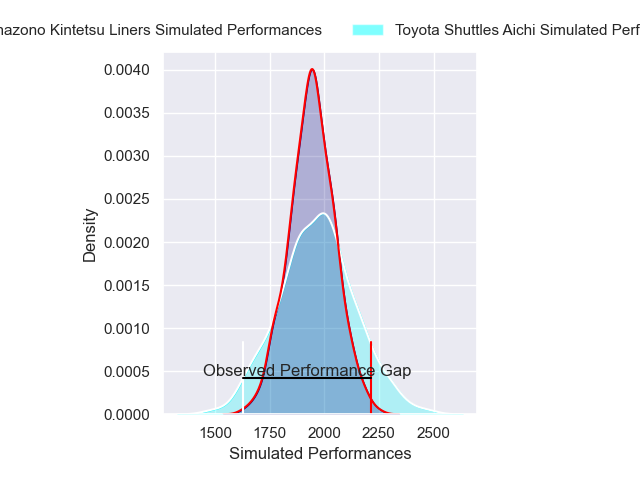
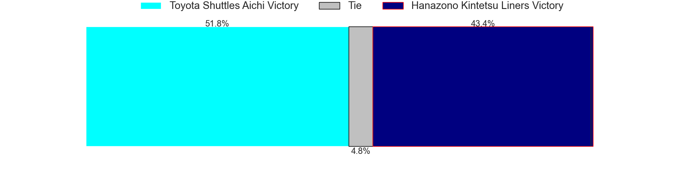

---  
layout: page  
title: Toyota Shuttles Aichi V Hanazono Kintetsu Liners on 2025/12/13  
date: 2025-12-13  
categories: "Japan Rugby League One D2 25/26" match projection  
---
# Toyota Shuttles Aichi V Hanazono Kintetsu Liners on 2025/12/13, 14.0 to 40.0

# Club Level Predictions

Now that the game has been played, lets see how the club predictions did. I predicted Toyota Shuttles Aichi to win by 1.18, and Hanazono Kintetsu Liners won by 26.0. That's an absolute error of 27.2 for the margin of victory, while my average absolute error has been 13.9 over the past six months. This prediction was more accurate than 13.4% of my recent predictions.

For the Over/Under model, I predicted a total of 56.5 and we have an actual total of 54.0. That's an absolute error of 2.5 compared to a six month average of 12.9. This prediction was more accurate than 86.8% of my recent predictions.
## Projected Performances - Club Model

## Projected Spreads - Club Model

## Projected Results - Club Model

