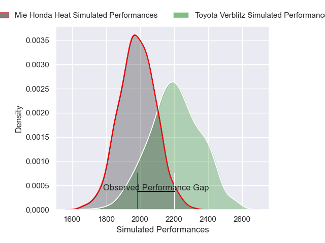
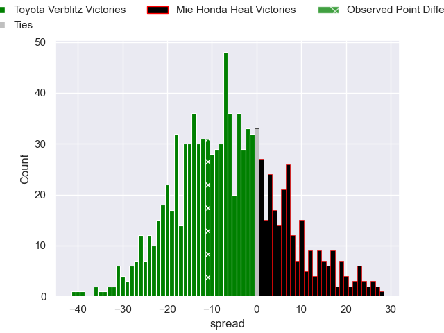

---  
layout: page  
title: Toyota Verblitz V Mie Honda Heat on 2025/12/13  
date: 2025-12-13  
categories: "Japan Rugby League One 25/26" match projection  
---
# Toyota Verblitz V Mie Honda Heat on 2025/12/13, 44.0 to 33.0

# Club Level Predictions

Now that the game has been played, lets see how the club predictions did. I predicted Toyota Verblitz to win by 5.69, and Toyota Verblitz won by 11.0. That's an absolute error of 5.3 for the margin of victory, while my average absolute error has been 13.9 over the past six months. This prediction was more accurate than 72.4% of my recent predictions.

For the Over/Under model, I predicted a total of 56.5 and we have an actual total of 77.0. That's an absolute error of 20.5 compared to a six month average of 12.9. This prediction was more accurate than 20.1% of my recent predictions.
## Projected Performances - Club Model

## Projected Spreads - Club Model

## Projected Results - Club Model

