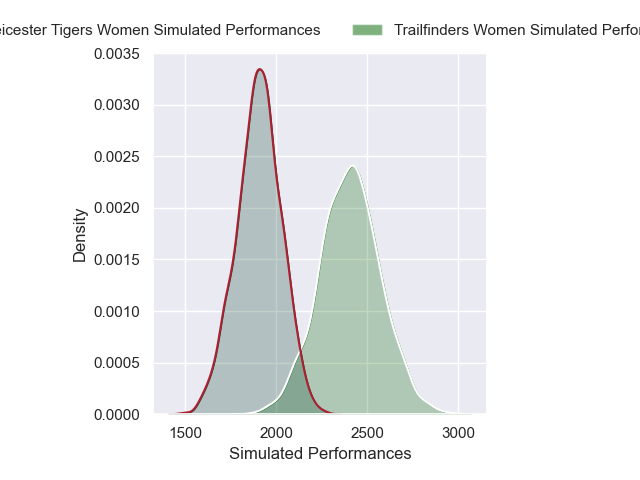
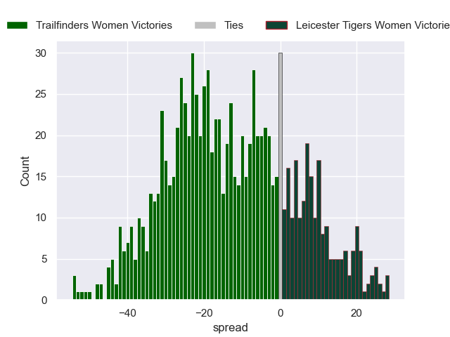

---  
layout: page  
title: Trailfinders Women V Leicester Tigers Women on 2025/12/13  
date: 2025-12-13  
categories: "PWR 25/26" match projection  
---
# Trailfinders Women V Leicester Tigers Women on 2025/12/13, 57.0 to 10.0

# Club Level Predictions

Now that the game has been played, lets see how the club predictions did. I predicted Trailfinders Women to win by 12.01, and Trailfinders Women won by 47.0. That's an absolute error of 35.0 for the margin of victory, while my average absolute error has been 13.9 over the past six months. This prediction was more accurate than 6.8% of my recent predictions.

For the Over/Under model, I predicted a total of 63.5 and we have an actual total of 67.0. That's an absolute error of 3.5 compared to a six month average of 12.9. This prediction was more accurate than 82.7% of my recent predictions.
## Projected Performances - Club Model

## Projected Spreads - Club Model

## Projected Results - Club Model

