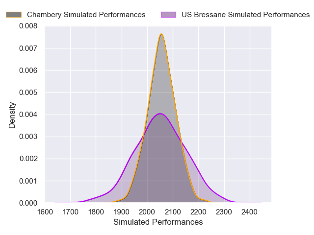
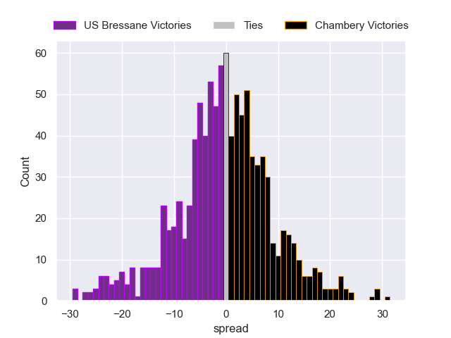

---  
layout: page  
title: US Bressane V Chambery on 2025/12/13  
date: 2025-12-13  
categories: "Nationale 25/26" match projection  
---
# US Bressane V Chambery on 2025/12/13, 20.0 to 17.0

# Club Level Predictions

Now that the game has been played, lets see how the club predictions did. I predicted Chambery to win by 0.62, and US Bressane won by 3.0. That's an absolute error of 3.6 for the margin of victory, while my average absolute error has been 13.9 over the past six months. This prediction was more accurate than 81.2% of my recent predictions.

For the Over/Under model, I predicted a total of 42.5 and we have an actual total of 37.0. That's an absolute error of 5.5 compared to a six month average of 12.9. This prediction was more accurate than 72.2% of my recent predictions.
## Projected Performances - Club Model

## Projected Spreads - Club Model

## Projected Results - Club Model

