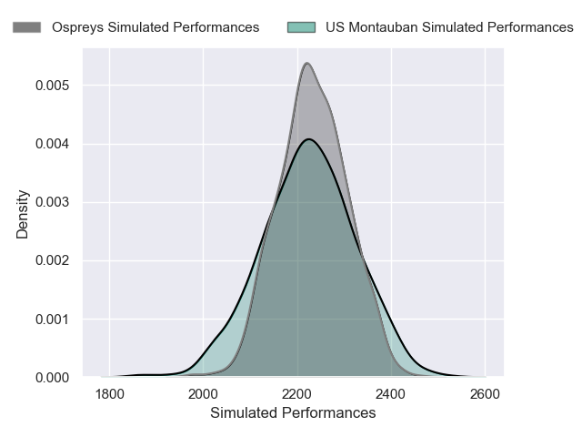
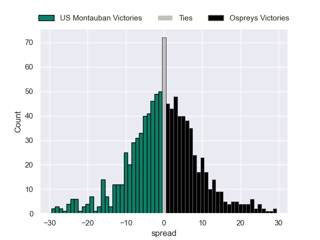

---  
layout: page  
title: US Montauban V Ospreys on 2025/12/13  
date: 2025-12-13  
categories: "European Rugby Challenge Cup 25/26" match projection  
---
# US Montauban V Ospreys on 2025/12/13, 22.0 to 33.0

# Club Level Predictions

Now that the game has been played, lets see how the club predictions did. I predicted Ospreys to win by 1.46, and Ospreys won by 11.0. That's an absolute error of 9.5 for the margin of victory, while my average absolute error has been 13.9 over the past six months. This prediction was more accurate than 51.7% of my recent predictions.

For the Over/Under model, I predicted a total of 55.5 and we have an actual total of 55.0. That's an absolute error of 0.5 compared to a six month average of 12.9. This prediction was more accurate than 97.5% of my recent predictions.
## Projected Performances - Club Model

## Projected Spreads - Club Model

## Projected Results - Club Model

