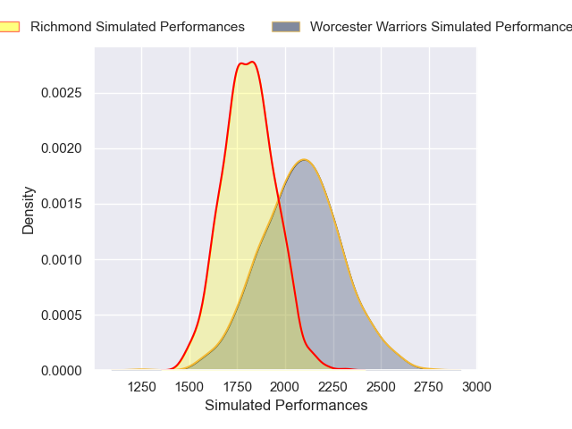
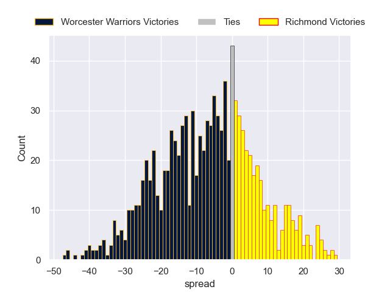

---  
layout: page  
title: Worcester Warriors V Richmond on 2025/12/13  
date: 2025-12-13  
categories: "RFU Championship 25/26" match projection  
---
# Worcester Warriors V Richmond on 2025/12/13, 31.0 to 19.0

# Club Level Predictions

Now that the game has been played, lets see how the club predictions did. I predicted Worcester Warriors to win by 8.95, and Worcester Warriors won by 12.0. That's an absolute error of 3.1 for the margin of victory, while my average absolute error has been 13.9 over the past six months. This prediction was more accurate than 84.9% of my recent predictions.

For the Over/Under model, I predicted a total of 56.5 and we have an actual total of 50.0. That's an absolute error of 6.5 compared to a six month average of 12.9. This prediction was more accurate than 68.0% of my recent predictions.
## Projected Performances - Club Model

## Projected Spreads - Club Model

## Projected Results - Club Model

