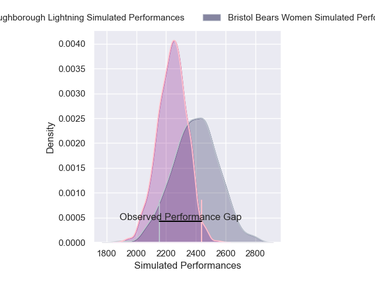
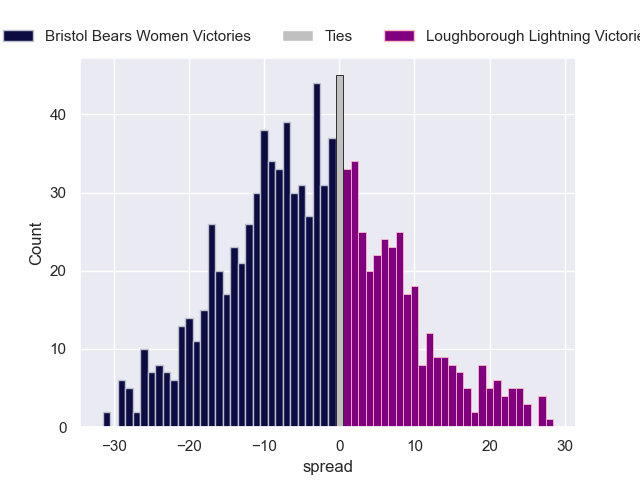

---  
layout: page  
title: Bristol Bears Women V Loughborough Lightning on 2025/12/14  
date: 2025-12-14  
categories: "PWR 25/26" match projection  
---
# Bristol Bears Women V Loughborough Lightning on 2025/12/14, 19.0 to 31.0

# Club Level Predictions

Now that the game has been played, lets see how the club predictions did. I predicted Bristol Bears Women to win by 4.13, and Loughborough Lightning won by 12.0. That's an absolute error of 16.1 for the margin of victory, while my average absolute error has been 13.9 over the past six months. This prediction was more accurate than 31.7% of my recent predictions.

For the Over/Under model, I predicted a total of 54.5 and we have an actual total of 50.0. That's an absolute error of 4.5 compared to a six month average of 12.9. This prediction was more accurate than 77.5% of my recent predictions.
## Projected Performances - Club Model

## Projected Spreads - Club Model

## Projected Results - Club Model

