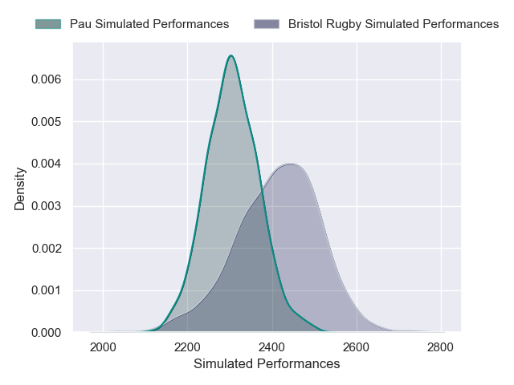
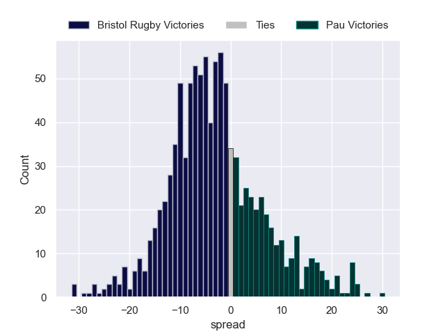

---  
layout: page  
title: Bristol Rugby V Pau on 2025/12/14  
date: 2025-12-14  
categories: "European Rugby Champions Cup 25/26" match projection  
---
# Bristol Rugby V Pau on 2025/12/14, 61.0 to 12.0

# Club Level Predictions

Now that the game has been played, lets see how the club predictions did. I predicted Bristol Rugby to win by 2.7, and Bristol Rugby won by 49.0. That's an absolute error of 46.3 for the margin of victory, while my average absolute error has been 13.9 over the past six months. This prediction was more accurate than 3.1% of my recent predictions.

For the Over/Under model, I predicted a total of 54.5 and we have an actual total of 73.0. That's an absolute error of 18.5 compared to a six month average of 12.9. This prediction was more accurate than 25.1% of my recent predictions.
## Projected Performances - Club Model

## Projected Spreads - Club Model

## Projected Results - Club Model

