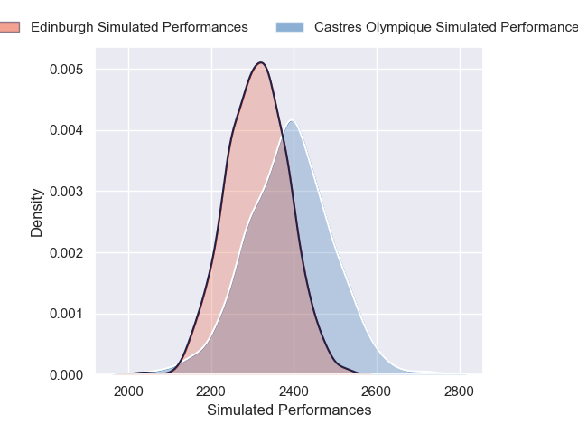
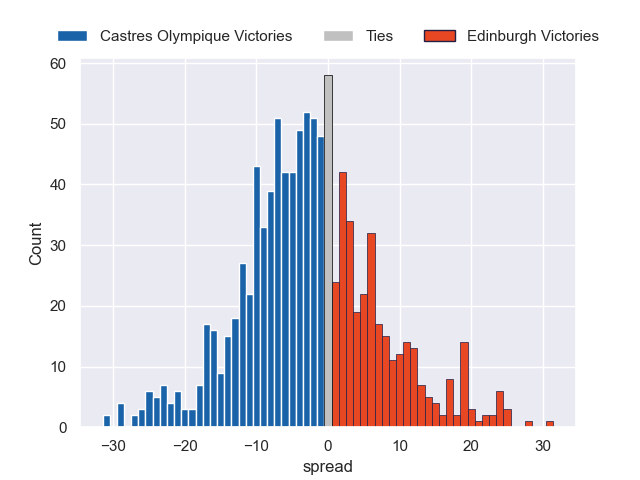

---  
layout: page  
title: Castres Olympique V Edinburgh on 2025/12/14  
date: 2025-12-14  
categories: "European Rugby Champions Cup 25/26" match projection  
---
# Castres Olympique V Edinburgh on 2025/12/14, 33.0 to 0.0

# Club Level Predictions

Now that the game has been played, lets see how the club predictions did. I predicted Castres Olympique to win by 2.63, and Castres Olympique won by 33.0. That's an absolute error of 30.4 for the margin of victory, while my average absolute error has been 13.9 over the past six months. This prediction was more accurate than 9.9% of my recent predictions.

For the Over/Under model, I predicted a total of 50.5 and we have an actual total of 33.0. That's an absolute error of 17.5 compared to a six month average of 12.9. This prediction was more accurate than 27.3% of my recent predictions.
## Projected Performances - Club Model

## Projected Spreads - Club Model

## Projected Results - Club Model

