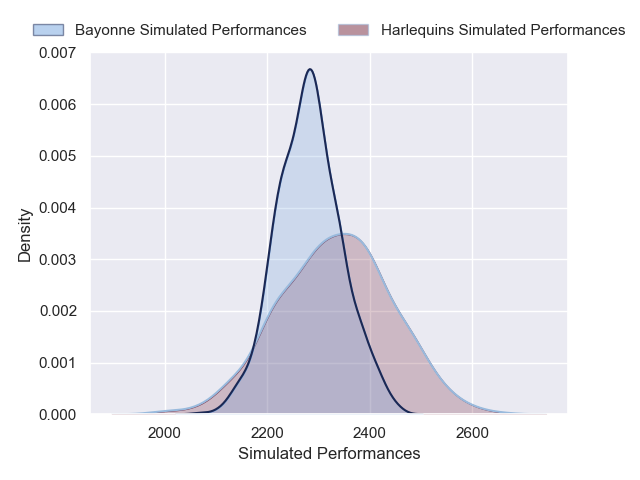
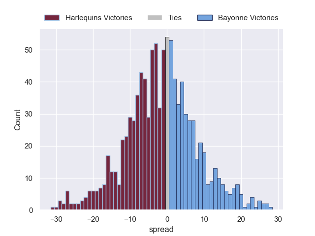

---  
layout: page  
title: Harlequins V Bayonne on 2025/12/14  
date: 2025-12-14  
categories: "European Rugby Champions Cup 25/26" match projection  
---
# Harlequins V Bayonne on 2025/12/14, 68.0 to 14.0

# Club Level Predictions

Now that the game has been played, lets see how the club predictions did. I predicted Harlequins to win by 0.29, and Harlequins won by 54.0. That's an absolute error of 53.7 for the margin of victory, while my average absolute error has been 13.9 over the past six months. This prediction was more accurate than 1.3% of my recent predictions.

For the Over/Under model, I predicted a total of 54.5 and we have an actual total of 82.0. That's an absolute error of 27.5 compared to a six month average of 12.9. This prediction was more accurate than 9.4% of my recent predictions.
## Projected Performances - Club Model

## Projected Spreads - Club Model

## Projected Results - Club Model

