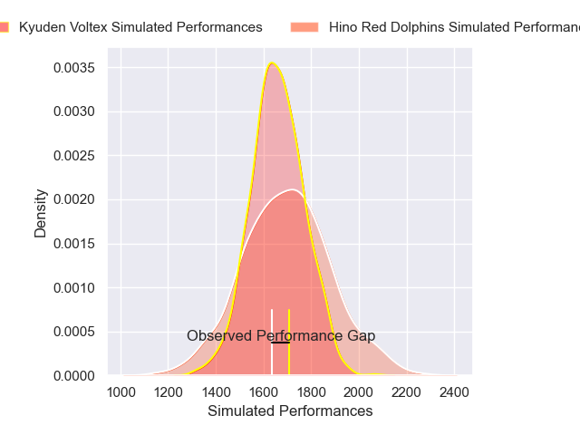
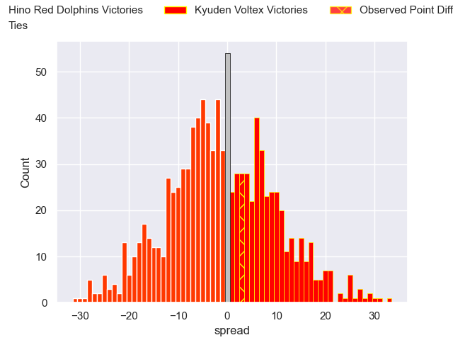

---  
layout: page  
title: Hino Red Dolphins V Kyuden Voltex on 2025/12/14  
date: 2025-12-14  
categories: "Japan Rugby League One D2 25/26" match projection  
---
# Hino Red Dolphins V Kyuden Voltex on 2025/12/14, 22.0 to 25.0

# Club Level Predictions

Now that the game has been played, lets see how the club predictions did. I predicted Hino Red Dolphins to win by 1.22, and Kyuden Voltex won by 3.0. That's an absolute error of 4.2 for the margin of victory, while my average absolute error has been 13.9 over the past six months. This prediction was more accurate than 77.4% of my recent predictions.

For the Over/Under model, I predicted a total of 56.5 and we have an actual total of 47.0. That's an absolute error of 9.5 compared to a six month average of 12.9. This prediction was more accurate than 53.7% of my recent predictions.
## Projected Performances - Club Model

## Projected Spreads - Club Model

## Projected Results - Club Model

