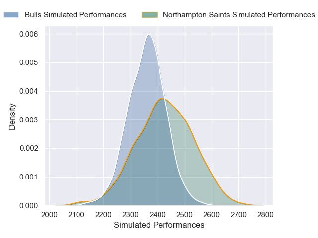
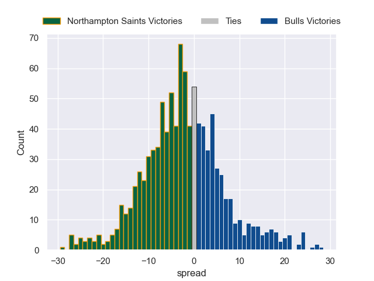

---  
layout: page  
title: Northampton Saints V Bulls on 2025/12/14  
date: 2025-12-14  
categories: "European Rugby Champions Cup 25/26" match projection  
---
# Northampton Saints V Bulls on 2025/12/14, 50.0 to 5.0

# Club Level Predictions

Now that the game has been played, lets see how the club predictions did. I predicted Northampton Saints to win by 0.61, and Northampton Saints won by 45.0. That's an absolute error of 44.4 for the margin of victory, while my average absolute error has been 13.9 over the past six months. This prediction was more accurate than 3.6% of my recent predictions.

For the Over/Under model, I predicted a total of 61.5 and we have an actual total of 55.0. That's an absolute error of 6.5 compared to a six month average of 12.9. This prediction was more accurate than 68.0% of my recent predictions.
## Projected Performances - Club Model

## Projected Spreads - Club Model

## Projected Results - Club Model

