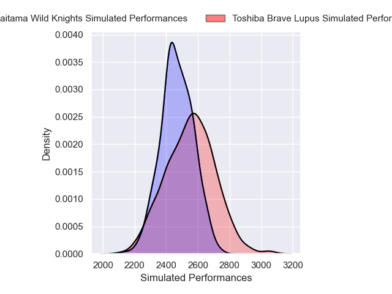
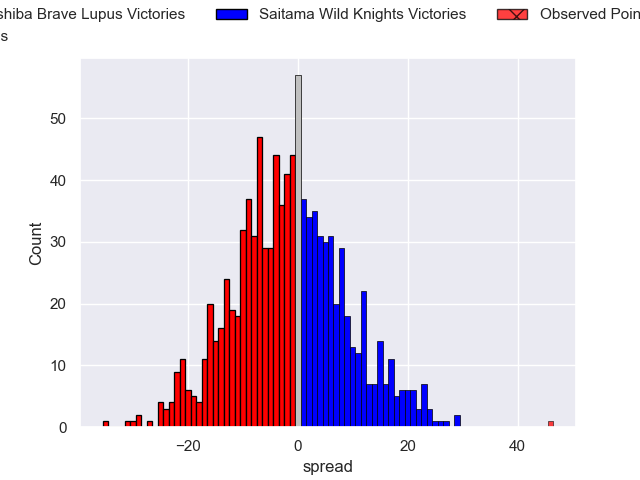

---  
layout: page  
title: Toshiba Brave Lupus V Saitama Wild Knights on 2025/12/14  
date: 2025-12-14  
categories: "Japan Rugby League One 25/26" match projection  
---
# Toshiba Brave Lupus V Saitama Wild Knights on 2025/12/14, 0.0 to 46.0

# Club Level Predictions

Now that the game has been played, lets see how the club predictions did. I predicted Toshiba Brave Lupus to win by 1.49, and Saitama Wild Knights won by 46.0. That's an absolute error of 47.5 for the margin of victory, while my average absolute error has been 13.9 over the past six months. This prediction was more accurate than 2.7% of my recent predictions.

For the Over/Under model, I predicted a total of 51.5 and we have an actual total of 46.0. That's an absolute error of 5.5 compared to a six month average of 12.9. This prediction was more accurate than 72.2% of my recent predictions.
## Projected Performances - Club Model

## Projected Spreads - Club Model

## Projected Results - Club Model

