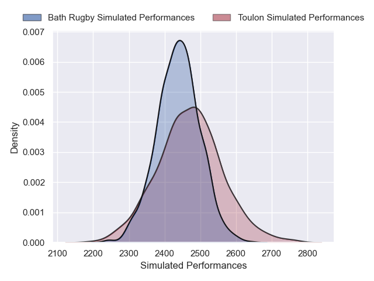
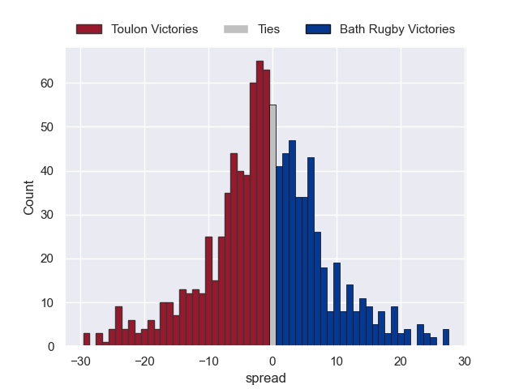

---  
layout: page  
title: Toulon V Bath Rugby on 2025/12/14  
date: 2025-12-14  
categories: "European Rugby Champions Cup 25/26" match projection  
---
# Toulon V Bath Rugby on 2025/12/14, 45.0 to 34.0

# Club Level Predictions

Now that the game has been played, lets see how the club predictions did. I predicted Toulon to win by 0.83, and Toulon won by 11.0. That's an absolute error of 10.2 for the margin of victory, while my average absolute error has been 13.9 over the past six months. This prediction was more accurate than 49.5% of my recent predictions.

For the Over/Under model, I predicted a total of 54.5 and we have an actual total of 79.0. That's an absolute error of 24.5 compared to a six month average of 12.9. This prediction was more accurate than 12.9% of my recent predictions.
## Projected Performances - Club Model

## Projected Spreads - Club Model

## Projected Results - Club Model

