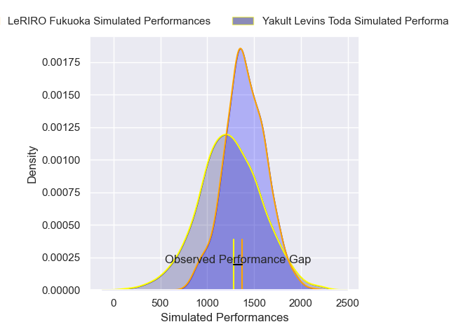
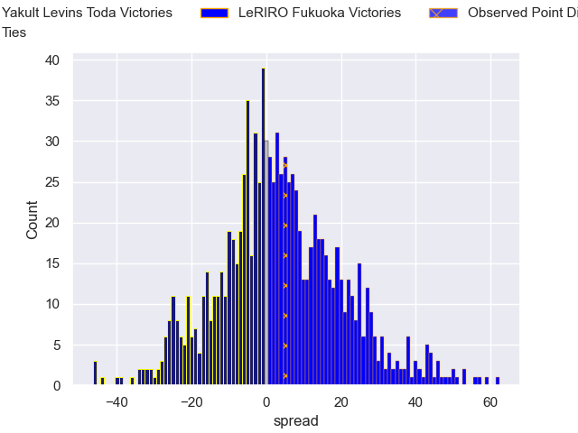

---  
layout: page  
title: Yakult Levins Toda V LeRIRO Fukuoka on 2025/12/14  
date: 2025-12-14  
categories: "Japan Rugby League One D3 25/26" match projection  
---
# Yakult Levins Toda V LeRIRO Fukuoka on 2025/12/14, 22.0 to 27.0

# Club Level Predictions

Now that the game has been played, lets see how the club predictions did. I predicted LeRIRO Fukuoka to win by 4.0, and LeRIRO Fukuoka won by 5.0. That's an absolute error of 1.0 for the margin of victory, while my average absolute error has been 13.9 over the past six months. This prediction was more accurate than 95.0% of my recent predictions.

For the Over/Under model, I predicted a total of 55.5 and we have an actual total of 49.0. That's an absolute error of 6.5 compared to a six month average of 12.9. This prediction was more accurate than 67.6% of my recent predictions.
## Projected Performances - Club Model

## Projected Spreads - Club Model

## Projected Results - Club Model

